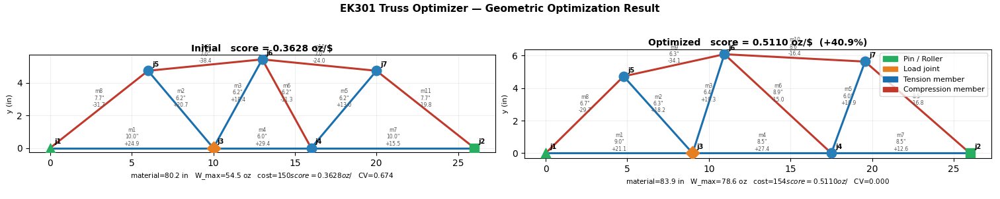
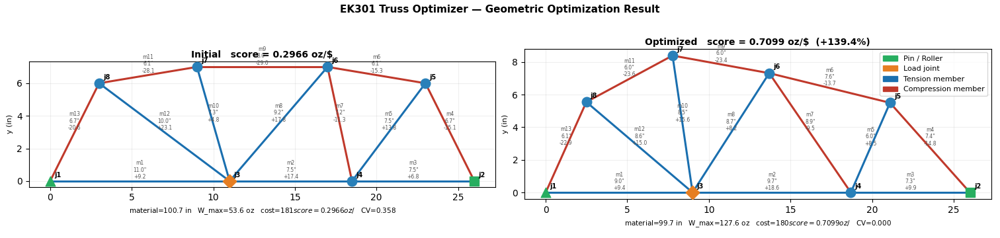
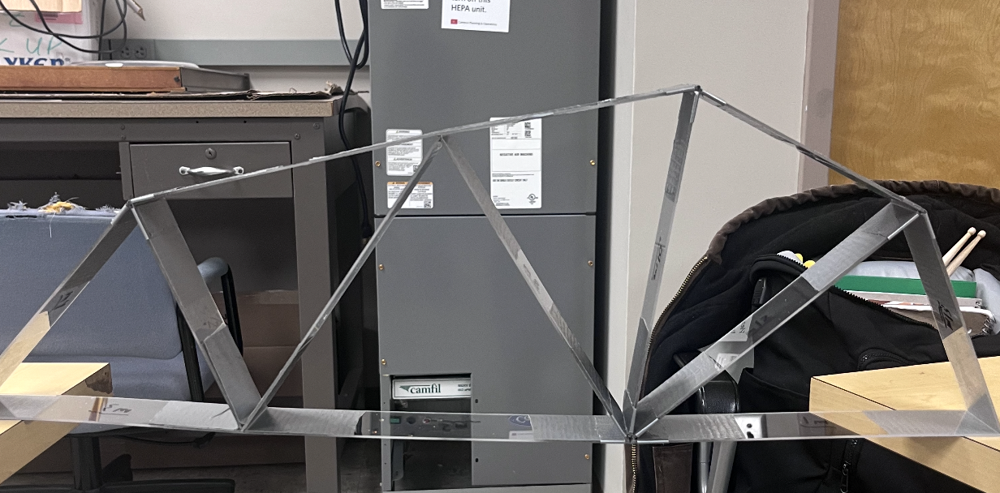

# EK301 Geometric Truss Optimizer

For my EK301 Engineering Mechanics final project, my team had to design and
physically build a truss from acrylic strips that maximizes its
load-to-cost ratio before any compression member buckles. With the complexity
of the design requirements and the size of the design space, finding a good
design purely by hand would be unlikely to find the true optimum.

I developed this program to take a truss topology (the connectivity between
joints) and find the optimal position for each joint to maximize
the load-to-cost ratio. The engineer's job is reduced to designing a good
topology — the computer handles the rest.

---

## Results

**7-joint truss** — score improved from 0.3628 → **0.5110 oz/$** (+40.9%). The optimizer raised the top chord joints and evened out member lengths, driving the coefficient of variation from 0.674 down to 0.000 — all compression members now buckle at exactly the same load.



**8-joint truss** — score improved from 0.2966 → **0.7099 oz/$** (+139.4%). The richer topology gave the optimizer more freedom; it restructured the geometry substantially, again converging to CV = 0.000 for perfectly balanced simultaneous failure.



**Final Design** - for our project, we opted for the 8-joint design, which end up holding ~ 116oz, achieving a 0.64 oz/$ ratio.

## 

## Table of Contents

- [Truss Requirements](#truss-requirements)
- [How It Works](#how-it-works)
  - [Truss Solving](#truss-solving)
  - [Validation](#validation)
  - [Optimization](#optimization)
- [Usage](#usage)
- [File Overview](#file-overview)
- [Takeaways](#takeaways)

---

## Truss Requirements

| Constraint                   | Value      |
| ---------------------------- | ---------- |
| Structural relation          | M = 2J − 3 |
| Truss span (pin to roller)   | 26 – 30 in |
| Load joint x-offset from pin | 9 – 11 in  |
| Load joint y-offset (Δy)     | 0 – 2 in   |
| Member length                | 6 – 14 in  |
| Total material               | ≤ 120 in   |
| Minimum supported load       | 32 oz      |

Cost model: `cost = total_length + 10 × J`. Performance metric: `W_max / cost`.

---

## How It Works

### Truss Solving

Member forces are found using the **method of joints**, assembled into a
linear system and solved directly:

```
A·T = L  →  T = −A⁻¹·L
```

The solver computes the force ratio `R_m = T_m / W` for each member, then
for each compression member finds the load at which it buckles:

```
W_failure_m = F_buckle(L_m) / |R_m|
```

where the buckling capacity (characterized experimentally from acrylic
compression tests) is:

```
F_buckle(L) = 37.5 × (10 / L)² − 10   (oz)
```

The critical member is whichever compression member has the smallest
`W_failure`, so `W_max = min(W_failure_m)`.

---

### Validation

Every candidate truss is checked against all spec constraints. Checks include:

- M = 2J − 3 (determinacy)
- All C matrix columns sum to exactly 2
- No duplicate members
- Member lengths within [6, 14] in (with a small floating-point tolerance)
- Total material ≤ 120 in
- All joints at or above baseline (y ≥ 0)
- Pin and roller joints on baseline
- Truss span 26 – 30 in
- Load joint x-offset 9 – 11 in, y-offset 0 – 2 in from pin
- No joint directly below the load joint
- No crossing members
- A matrix is invertible (truss is statically determinate)

Validation runs on both the initial design and the optimized result, and
results are printed as a pass/fail report.

---

### Optimization

Given a fixed topology (C matrix), the optimizer finds joint coordinates that
maximize `W_max / cost`.

**Stage 1 — Differential Evolution (global search)**

DE maintains a population of candidate joint coordinate vectors and evolves
them over many generations via mutation, crossover, and selection. Constraint
violations are penalized quadratically. The objective minimized is:

```
−(W_max / cost) + λ × CV(W_failure)
```

The second term is a **simultaneous-failure penalty** — a theoretically
optimal truss has all compression members failing at the same load (CV = 0),
so penalizing the coefficient of variation (σ/μ of per-member failure loads)
pushes toward balanced designs where no material capacity is wasted.

**Stage 2 — L-BFGS-B polish (local refinement)**

The best DE solution is automatically passed to a gradient-based optimizer
(`polish=True` in `scipy.differential_evolution`) to fine-tune joint positions
to the nearest precise local optimum.

**Multi-seed strategy**

Multiple independent DE runs are launched from different random seeds to
reduce the chance of getting stuck in a local optimum. The best result across
all seeds is kept. Seeds can be run **sequentially** (with live per-evaluation
console output) or **in parallel** across CPU cores (faster, but silent during
the run). This is controlled by the `parallel` flag in the YAML.

```
    FIXED TOPOLOGY (C matrix, initial XY)
                    │
                    ▼
┌─────────────────────────────────────────────┐
│           Differential Evolution            │
│  population of candidate joint vectors      │
│  each evaluated against:                    │
│    • hard constraint penalties              │
│    • maximize W_max / cost                  │
│    • simultaneous-failure penalty (λ·CV)    │
│    mutate → crossover → select → repeat     │
└───────────────────┬─────────────────────────┘
                    │  best solution per seed
                    ▼
┌─────────────────────────────────────────────┐
│             L-BFGS-B polish                 │
│        gradient-based fine-tuning           │
└───────────────────┬─────────────────────────┘
                    │
                    ▼
         pick best across all seeds
                    │
                    ▼
       OPTIMIZED JOINT POSITIONS
         maximizing W_max / cost
```

---

## Usage

Install dependencies:

```bash
source venv/bin/activate
pip install -r requirements.txt
```

Edit your truss in a YAML file (e.g. `truss.yaml`):

```yaml
joints:
  j1: [0.0, 0.0]
  j2: [26.0, 0.0]
  j3: [10.0, 0.0]
  # ...

members:
  - [1, 3] # m1
  - [3, 4] # m2
  # ...

pin_joint: 1
roller_joint: 2
load_joint: 3
load_oz: 32.0

search_mode: NORMAL # QUICK | NORMAL | DEEP
parallel: false # true = faster but no live output

stock: [48, 48, 24]
```

Then run:

```bash
python main.py                  # uses truss.yaml by default
python main.py truss7j.yaml     # use a different yaml
```

The program runs five steps and prints results for each:

1. **Validate** the initial design
2. **Optimize** joint positions (DE + L-BFGS-B polish)
3. **Validate** the optimized design
4. **Cut plan** — assigns members to stock pieces
5. **Plot** — before/after comparison saved to `optimized_truss.png`

### Search modes

| Mode     | Seeds | Max iters | Approx time           |
| -------- | ----- | --------- | --------------------- |
| `QUICK`  | 1     | 1000      | ~30 sec               |
| `NORMAL` | 3     | 2500      | a few minutes         |
| `DEEP`   | 6     | 5000      | longest, best results |

---

## File Overview

| File                  | Description                                                    |
| --------------------- | -------------------------------------------------------------- |
| `main.py`             | Workflow entry point — loads YAML, runs all 5 steps            |
| `truss.yaml`          | Default truss input (8 joints, 13 members)                     |
| `truss7j.yaml`        | Alternative 7-joint topology                                   |
| `solver.py`           | Method-of-joints solver, buckling model, cost/metrics          |
| `design_validator.py` | Full spec constraint checker with pass/fail report             |
| `optimizer.py`        | DE + L-BFGS-B optimizer, sequential and parallel modes         |
| `cut_planner.py`      | Backtracking cut assignment for stock pieces                   |
| `visualizer.py`       | Before/after comparison plot with tension/compression coloring |

---

## Takeaways

**Topology matters more than geometry.** The optimizer can only improve a
design within its existing connectivity. Most performance gain came from
choosing a good topology — the optimizer contributed further improvement on
top of that initial choice.

**Simultaneous failure is the theoretical optimum.** If one compression
member buckles long before the others, material capacity is wasted elsewhere.
The simultaneous-failure penalty drove the design toward a state where all
compression members buckle at approximately the same load.

**Separating topology from geometry simplifies the problem.** Fixing topology
and optimizing geometry turns a discontinuous combinatorial problem into a
continuous one that DE + L-BFGS-B handles well. Searching topologies by hand
with geometric intuition as a guide proved to be an effective division of
labor between engineer and computer.
